# 36 Days Through Their Eyes

**An interactive narrative that lets you live through the July 2024 uprising in Bangladesh — through the eyes of ordinary people — with choices grounded in real, cited history.**

Built for Hackathon 2026 — Track B: Spirit of July.

---

## What this is

36 Days Through Their Eyes is not an archive and not a game in the traditional sense. It's a short interactive story where you make decisions as one of three ordinary people living through the days between the quota-reform protests and the fall of the Hasina government in August 2024. Every day you pass through is a real, documented event. Your character's specific choices are fiction, and every major beat is cited to a public source.

> No matter what you choose, **the story always leads back to the same real history.**
> That single rule is what separates this from a branching game — you can change how a moment is lived, never what actually happened.

At the end, your character's story dissolves into a short, sourced account of what really happened — because the goal isn't to invent an alternate history, it's to make a well-documented one easier to feel and remember.

## Why we built it this way

Several strong archival and evidence-verification projects already exist for this movement — most notably the [Bangladesh Protest Archive](https://www.thedailystar.net/news/bangladesh/news/1500-videos-photos-july-atrocities-collected-3813956), a collective effort with thousands of hours of documented footage. We didn't want to build a smaller, weaker version of something that already exists and is done well. Instead, we built the thing an archive can't be on its own: something that makes people *feel* the timeline, not just look it up.

**A note on sensitivity:** every character in this project is a composite, built from publicly reported patterns of experience — not a real named individual, and not anyone's private testimony. Every historical beat is drawn from and cited to public sources (see below). Separately, our **Memory Wall** honors real, named individuals who lost their lives — deliberately kept apart from the fictional composite characters, and sourced rather than dramatized.

## Try it

- **Live Demo:** [https://36-days-through-their-eyes.vercel.app/](https://36-days-through-their-eyes.vercel.app/)
- **GitHub:** [github.com/srabanimitra/36-Days-Through-Their-Eyes](https://github.com/srabanimitra/36-Days-Through-Their-Eyes)
- **Demo Video (3 min):** [Watch on Google Drive](https://drive.google.com/file/d/1YxtGGUWNukf3YT3P4C9eH7gNiiHvQeCr/view?usp=sharing)

## Screenshots

**Landing**

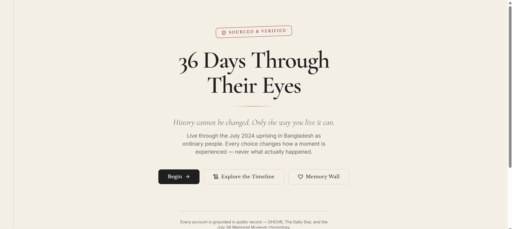

**Prologue** — framing and sensitivity note before you choose a perspective

| Intro | Composites & citations | History never changes |
|---|---|---|
| 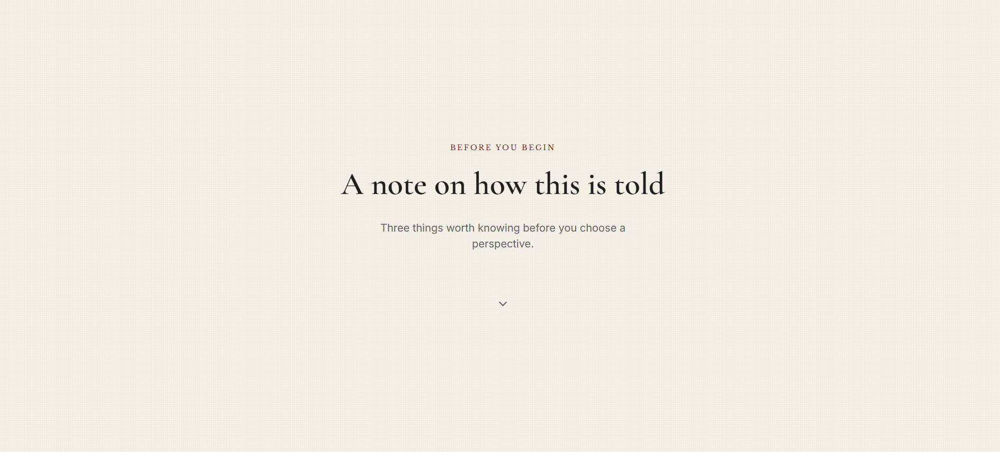 | 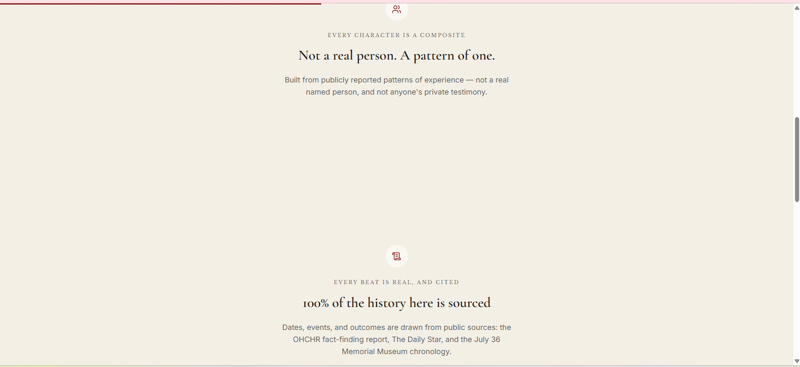 | 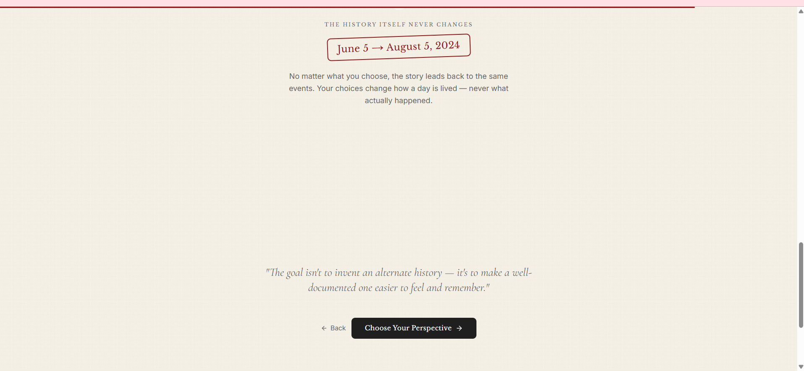 |

**Character Select**

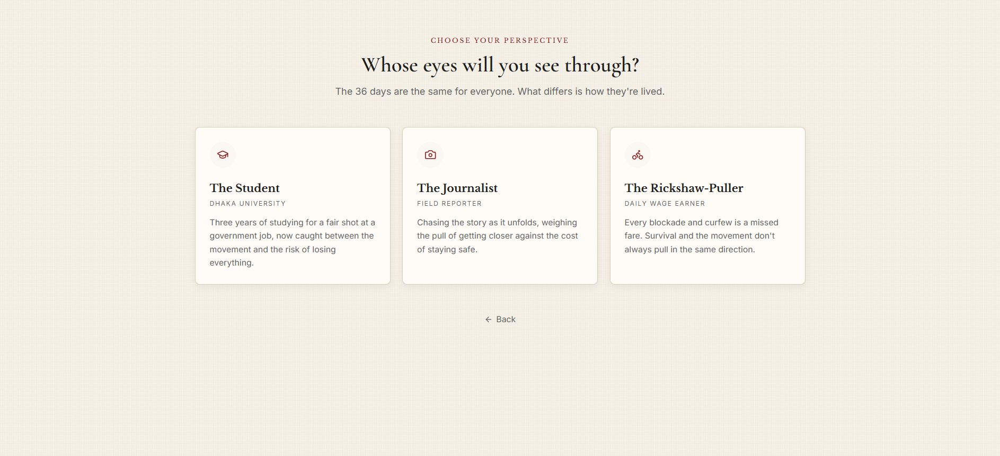

**Chapter — decision, then the real, cited reveal**

| Before the choice | After the choice (reality reveal) |
|---|---|
| 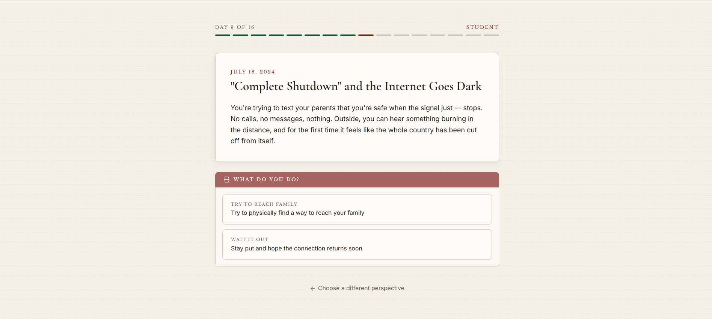 | 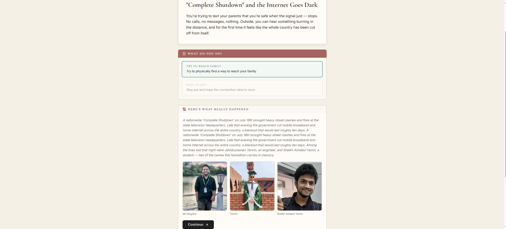 |

**Ending — memorial and reflection**

| The fiction dissolves | Reflection prompt |
|---|---|
|  |  |

**Then & Now** — what happened after August 5, still cited

| | |
|---|---|
| 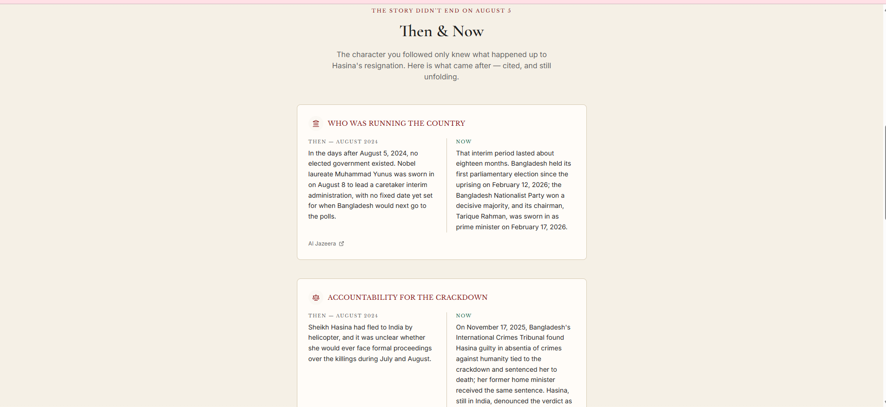 | 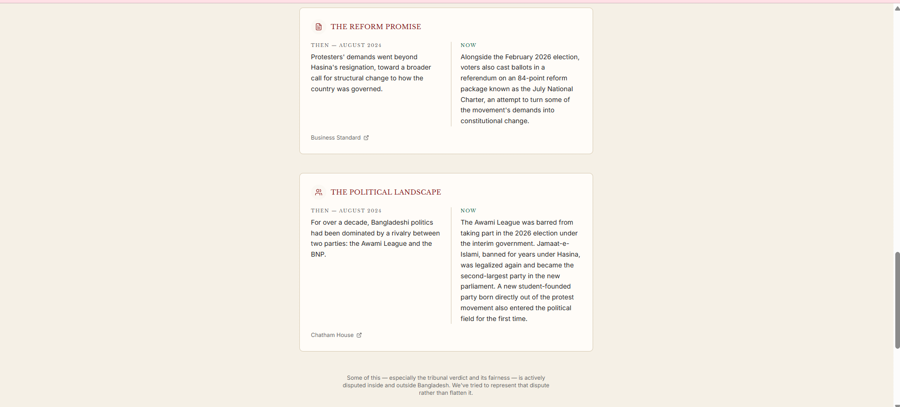 |

**Loading Screen**

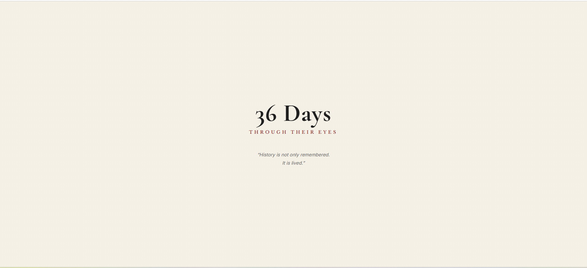

**Timeline** — the full historical spine, independently browsable

| Intro | A day in the middle | The final day |
|---|---|---|
| 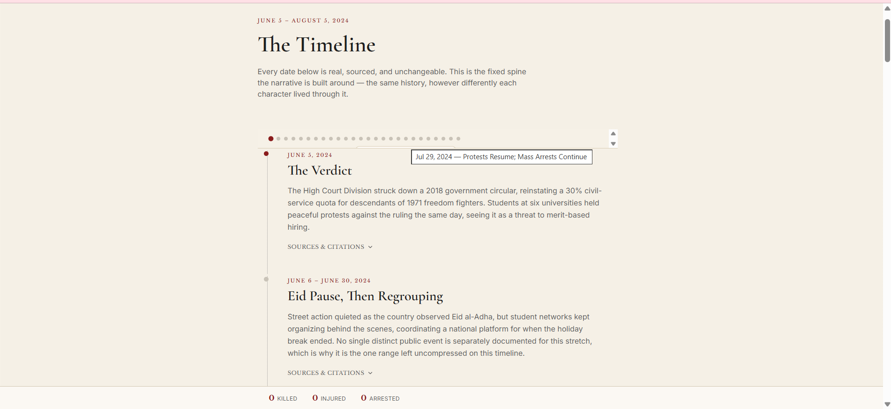 | 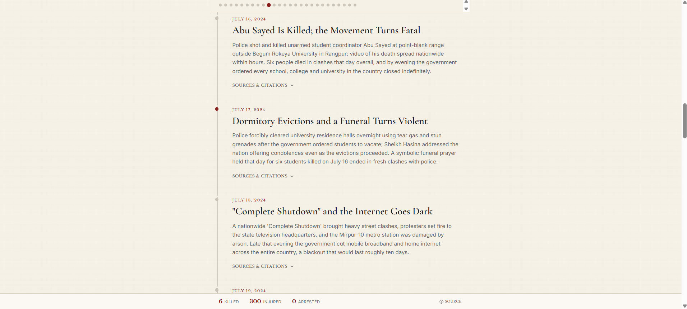 | 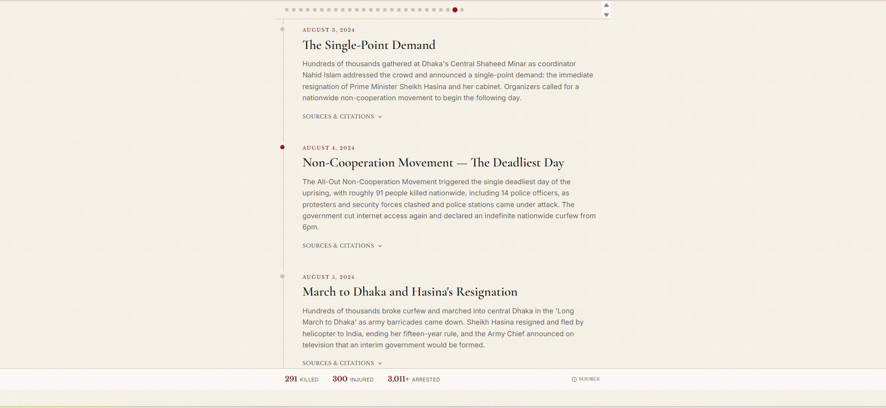 |

**Memory Wall** — real names, real people, real sources

| | | |
|---|---|---|
| 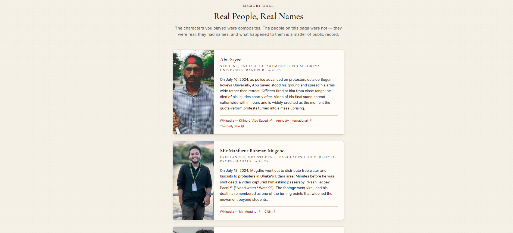 | 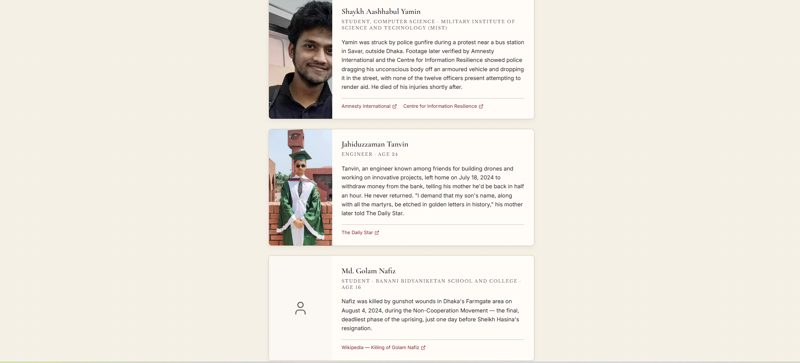 | 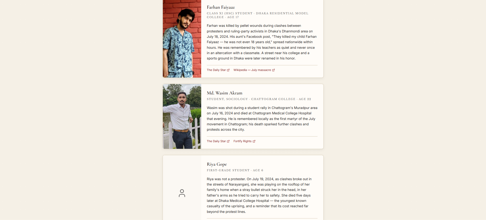 |

**Sources & Methodology**

| Overview | A source list entry |
|---|---|
| 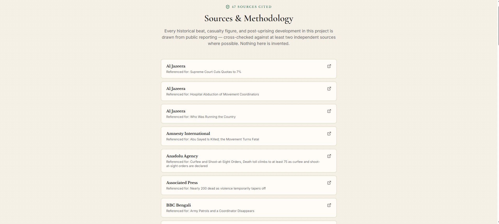 | 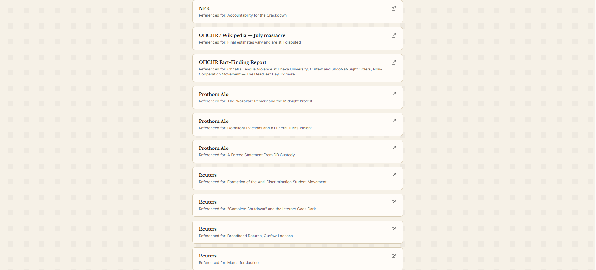 |

**Completion Certificate**

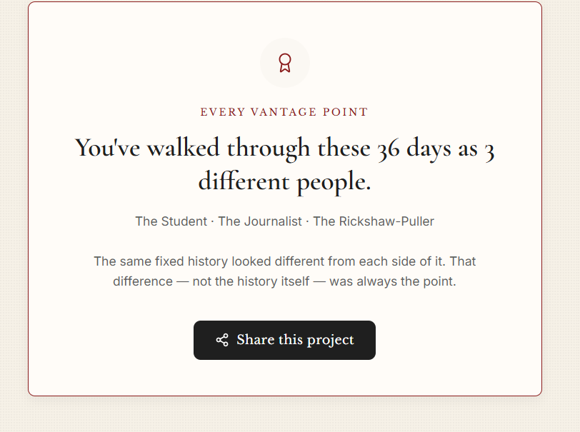

## Goals

- Encourage historical understanding through empathy, not just information.
- Preserve factual accuracy through verifiable, publicly cited sources.
- Present multiple lived perspectives without rewriting or inventing history.
- Keep fictional composite characters clearly separate from real, named individuals.

## Features

- **Three playable perspectives** — a student, a journalist, and a rickshaw-puller — living through the same historical timeline in different ways
- **26 sourced historical timeline nodes** and **16 playable chapters**, spanning the June 2024 quota verdict through Sheikh Hasina's resignation on August 5, 2024
- **Reality reveal panels** — after each choice, a panel shows what actually happened that day, cited to a public source, sometimes with an archival photo
- **Timeline page** — the full historical spine, independently browsable outside of any character's story, with a sticky scrubber and per-node source citations
- **Human Cost Strip** — a running count that only advances at real, reported checkpoints, never an invented or estimated figure
- **Memorial ending** — each character's fictional arc dissolves into a short, sourced account of what really happened, followed by a "Then & Now" epilogue covering the aftermath
- **Completion Certificate** — awarded once a player has completed all three perspectives, with a share option
- **Memory Wall** — real names, real people, real sources: eight individuals who lost their lives, presented separately from the fictional characters
- **Sources page** — every citation used across the app (47 sources) aggregated and linked in one place
- **47 cited public sources** in total, cross-referenced across the official memorial museum chronology, OHCHR reporting, and contemporary news coverage
- **No backend, no accounts, no tracking** — a static-data site; the only thing stored is your own progress, kept locally in your browser

## Tech stack

- Next.js (App Router) + React
- Static JSON data layer (no database)
- Deployed on Vercel
- Client-side progress tracking via `localStorage` (no server-side persistence)

## Getting started

Clone the repository:

```bash
git clone https://github.com/srabanimitra/36-Days-Through-Their-Eyes.git
cd 36-Days-Through-Their-Eyes
```

Install dependencies:

```bash
npm install
```

Run the development server:

```bash
npm run dev
```

The app will be available at `http://localhost:3000`.

Build for production:

```bash
npm run build
```

## Project structure

```
36-Days-Through-Their-Eyes/
├── app/
│   ├── page.js                  # Landing
│   ├── prologue/page.js         # Framing / sensitivity note
│   ├── characters/page.js       # Character select
│   ├── chapters/[id]/page.js    # Scene renderer — choices + reality reveal
│   ├── timeline/page.js         # Full browsable historical timeline
│   ├── ending/page.js           # Memorial + Then & Now epilogue
│   ├── memory-wall/page.js      # Real, named individuals
│   ├── sources/page.js          # Aggregated citations
│   ├── layout.js
│   └── providers.jsx
├── components/
│   ├── Certificate.jsx
│   ├── Footer.jsx
│   ├── HumanCostStrip.jsx
│   ├── LoadingScreen.jsx
│   ├── ThenNowEpilogue.jsx
│   └── TimelineScrubber.jsx
├── data/
│   ├── timeline.json            # The historical spine (26 nodes)
│   ├── chapters.json            # Playable chapters (16)
│   ├── characters.json          # The three playable perspectives
│   ├── human-cost.json          # Reported checkpoint figures
│   ├── memoryWall.json          # Real individuals, sourced
│   ├── epilogue.json            # Then & Now content
│   └── sources.json             # All 47 citations
├── lib/
│   ├── character.js             # Selected-character state (localStorage)
│   ├── completion.js            # Completion tracking (localStorage)
│   ├── helpers.js
│   └── useReducedMotion.js
├── public/
│   ├── memory-wall/             # Photos for real individuals
│   └── timeline/                # Archival/illustrative photos
├── README.md
└── LICENSE
```

## Narrative architecture

```
User
  ↓
Prologue (framing, sensitivity note)
  ↓
Choose Perspective
  ↓
Historical Event (per chapter)
  ↓
Decision
  ↓
Reality Reveal (cited)
  ↓
Next Event ... (repeat across chapters)
  ↓
Memorial + Then & Now
  ↓
Certificate (after all perspectives completed)
```

The story is driven by a shared set of historical timeline nodes (`data/timeline.json`), each cited to a public source. Character-specific chapters (`data/chapters.json`) layer distinct scene text and choices on top of that same spine — so the sequence of real events never changes between playthroughs, only whose eyes you're seeing them through.

## Sources

The historical timeline is built primarily from:

- July Mass Uprising Memorial Museum — official chronology: [july36.gov.bd/chronology](https://july36.gov.bd/chronology)
- OHCHR Fact-Finding Report: Human Rights Violations and Abuses related to the Protests of July and August 2024 in Bangladesh
- The Daily Star, contemporary reporting
- Wikipedia, "Timeline of the July Revolution" and related pages (cross-reference only, not a primary source)

All 47 individual citations, with publisher, date, and direct link, are listed in-app on the [Sources page](/sources) and shown inline at the point where each is used.

## Team

| Name | Responsibilities |
|---|---|
| Srabani Mitra | Application architecture, Next.js development, deployment (Vercel); timeline data collection; historical research; Sources page; submission materials & Facebook post |
| Twaseen Tabassum | Narrative writing (scene text, choices, memorial text); UI/UX design & styling; historical research; Memory Wall content & photos; demo video; README |

## License

This project is licensed under the MIT License — see [LICENSE](./LICENSE) for details.

## Acknowledgements

Built with respect for everyone who lived through, documented, and did not survive the events of July–August 2024. Corrections to factual content are welcome via issue or pull request.